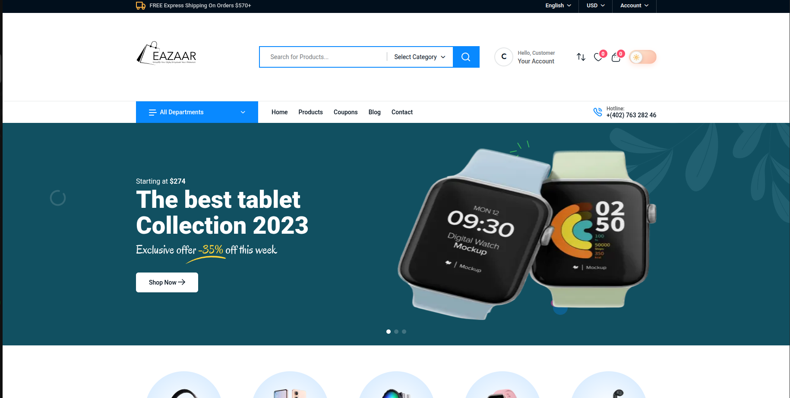
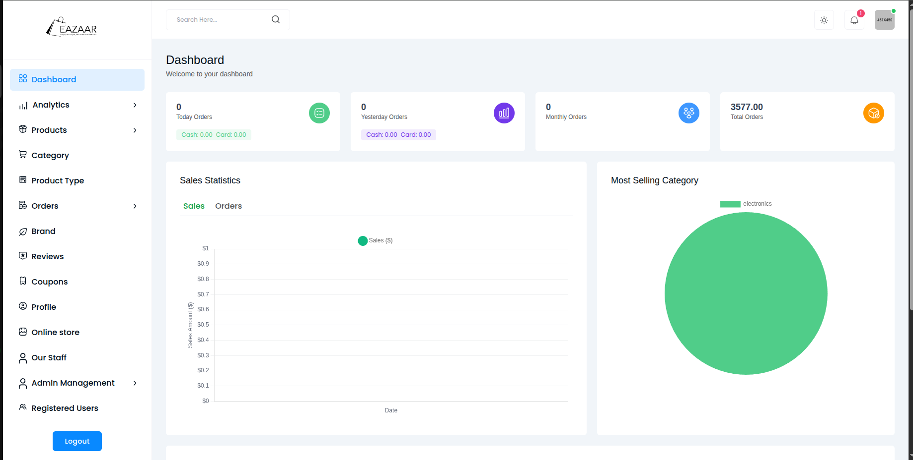

<div align="center">
  <a href="https://github.com/erfanal1n/EAZAAR-FULL-STACK-E-COMMERCE-">
    
  </a>

  <h1 align="center">EAZAAR - Full Stack E-commerce Platform</h1>

  <p align="center">
    A comprehensive modern e-commerce platform built from scratch with enterprise-level functionality
    <br />
    <a href="#-about-the-project"><strong>Explore the docs »</strong></a>
    <br />
    <br />
    <a href="https://eazaar-frontend.vercel.app/">View Demo</a>
    ·
    <a href="https://eazaar-admin.vercel.app/">Admin Panel</a>
    ·
    <a href="https://github.com/erfanal1n/EAZAAR-FULL-STACK-E-COMMERCE-/issues">Report Bug</a>
    ·
    <a href="https://github.com/erfanal1n/EAZAAR-FULL-STACK-E-COMMERCE-/issues">Request Feature</a>
  </p>
</div>

<!-- PROJECT SHIELDS -->
<div align="center">

[![Contributors][contributors-shield]][contributors-url]
[![Forks][forks-shield]][forks-url]
[![Stargazers][stars-shield]][stars-url]
[![Issues][issues-shield]][issues-url]
[![MIT License][license-shield]][license-url]
[![LinkedIn][linkedin-shield]][linkedin-url]

</div>

<!-- TABLE OF CONTENTS -->
<details>
  <summary>Table of Contents</summary>
  <ol>
    <li>
      <a href="#-about-the-project">About The Project</a>
      <ul>
        <li><a href="#-built-with">Built With</a></li>
      </ul>
    </li>
    <li>
      <a href="#-getting-started">Getting Started</a>
      <ul>
        <li><a href="#prerequisites">Prerequisites</a></li>
        <li><a href="#installation">Installation</a></li>
      </ul>
    </li>
    <li><a href="#-usage">Usage</a></li>
    <li><a href="#-features">Features</a></li>
    <li><a href="#-architecture">Architecture</a></li>
    <li><a href="#-api-documentation">API Documentation</a></li>
    <li><a href="#-demo-protection">Demo Protection</a></li>
    <li><a href="#-roadmap">Roadmap</a></li>
    <li><a href="#-contributing">Contributing</a></li>
    <li><a href="#-license">License</a></li>
    <li><a href="#-contact">Contact</a></li>
    <li><a href="#-acknowledgments">Acknowledgments</a></li>
  </ol>
</details>

<!-- ABOUT THE PROJECT -->
## 🚀 About The Project

<div align="center">
  
  <br><br>
  
</div>

EAZAAR is a comprehensive full-stack e-commerce platform that showcases modern web development practices and enterprise-level architecture. Built from scratch with cutting-edge technologies, it demonstrates advanced skills in frontend development, backend architecture, database design, and DevOps practices.

### 📈 Key Metrics
* **25+ React Components** - Modular and reusable architecture
* **15+ RESTful API Endpoints** - Clean and documented
* **5+ Payment Integration Methods** - Including Stripe, PayPal, COD
* **3 User Role Systems** - Admin, Customer, Staff with proper authorization
* **Mobile-First Design** - Fully responsive across all devices
* **58+ Protected Routes** - Comprehensive demo protection system

<p align="right">(<a href="#top">back to top</a>)</p>

### 🛠 Built With

#### Frontend Technologies
* [![Next][Next.js]][Next-url]
* [![React][React.js]][React-url]
* [![TypeScript][TypeScript]][TypeScript-url]
* [![Redux][Redux]][Redux-url]
* [![TailwindCSS][TailwindCSS]][Tailwind-url]

#### Backend Technologies
* [![Node][Node.js]][Node-url]
* [![Express][Express.js]][Express-url]
* [![MongoDB][MongoDB]][MongoDB-url]
* [![JWT][JWT]][JWT-url]

#### DevOps & Tools
* [![Vercel][Vercel]][Vercel-url]
* [![Cloudinary][Cloudinary]][Cloudinary-url]
* [![Stripe][Stripe]][Stripe-url]
* [![Git][Git]][Git-url]

<p align="right">(<a href="#top">back to top</a>)</p>

<!-- GETTING STARTED -->
## 🚦 Getting Started

To get a local copy up and running, follow these simple steps.

### Prerequisites

Before you begin, ensure you have the following installed:
* Node.js 18.0 or higher
  ```sh
  node --version
  ```
* MongoDB (local or Atlas connection)
* Git

### Installation

1. **Clone the repository**
   ```sh
   git clone https://github.com/erfanal1n/EAZAAR-FULL-STACK-E-COMMERCE-.git
   cd EAZAAR-FULL-STACK-E-COMMERCE-
   ```

2. **Backend Setup**
   ```sh
   cd eazaar-backend
   npm install
   cp .env.example .env
   # Configure your environment variables
   npm run dev
   ```

3. **Frontend Setup**
   ```sh
   cd ../eazaar-front-end
   npm install
   cp .env.local.example .env.local
   # Configure your environment variables
   npm run dev
   ```

4. **Admin Panel Setup**
   ```sh
   cd ../eazaar-admin-panel
   npm install
   cp .env.local.example .env.local
   # Configure your environment variables
   npm run dev
   ```

### Environment Configuration

**Backend (.env)**
```env
PORT=7000
DB_URL=your_mongodb_connection_string
TOKEN_SECRET=your_jwt_secret_key
STRIPE_SECRET_KEY=your_stripe_secret_key
CLOUDINARY_NAME=your_cloudinary_cloud_name
CLOUDINARY_API_KEY=your_cloudinary_api_key
CLOUDINARY_API_SECRET=your_cloudinary_api_secret
EMAIL_USER=your_smtp_email
EMAIL_PASS=your_smtp_password
```

**Frontend & Admin (.env.local)**
```env
NEXT_PUBLIC_API_URL=http://localhost:7000/api
NEXT_PUBLIC_STRIPE_PUBLISHABLE_KEY=your_stripe_publishable_key
```

<p align="right">(<a href="#top">back to top</a>)</p>

<!-- USAGE EXAMPLES -->
## 🎮 Usage

### Live Demo Access

**🛍️ Customer Frontend**
- **URL:** [https://eazaar-frontend.vercel.app/](https://eazaar-frontend.vercel.app/)
- **Demo Account:** 
  - Email: `customer@demo.com`
  - Password: `demo123`

**🎛️ Admin Dashboard**
- **URL:** [https://eazaar-admin.vercel.app/](https://eazaar-admin.vercel.app/)
- **Demo Account:** 
  - Email: `demo@eazaar.com`
  - Password: `demo123`

> **Note:** Demo accounts have full visibility but modifications are protected to maintain data integrity.

<p align="right">(<a href="#top">back to top</a>)</p>

<!-- FEATURES -->
## ✨ Features

### 🛍️ Customer Experience
- **Product Catalog** - Advanced filtering, search, and sorting
- **Shopping Cart** - Persistent cart with quantity management
- **Wishlist System** - Save and manage favorite products
- **Product Comparison** - Side-by-side product comparison
- **User Authentication** - Secure JWT-based login system
- **Order Tracking** - Real-time order status updates
- **Multiple Payment Options** - Stripe, PayPal, Cash on Delivery
- **Coupon System** - Discount codes and promotional offers
- **Responsive Design** - Optimized for all screen sizes

### 🎛️ Admin Dashboard
- **Analytics Dashboard** - Comprehensive sales and customer insights
- **Product Management** - CRUD operations with bulk actions
- **Order Processing** - Order status management and tracking
- **Customer Management** - User account administration
- **Inventory Control** - Stock level monitoring and alerts
- **Coupon Management** - Create and manage promotional campaigns
- **Staff Management** - Role-based access control
- **Content Management** - Dynamic content and banner management

### 🔧 Technical Features
- **RESTful API Architecture** - Clean, documented endpoints
- **Database Optimization** - Efficient queries and proper indexing
- **State Management** - Redux Toolkit for complex state handling
- **Form Validation** - Client and server-side validation
- **Error Handling** - Comprehensive error management system
- **Security Implementation** - Input sanitization and CORS protection
- **Performance Optimization** - Code splitting and lazy loading

<p align="right">(<a href="#top">back to top</a>)</p>

<!-- ARCHITECTURE -->
## 🏗️ Architecture

```
EAZAAR/
├── eazaar-front-end/          # Next.js Customer Frontend
│   ├── src/
│   │   ├── app/               # App router pages
│   │   ├── components/        # Reusable UI components
│   │   ├── hooks/             # Custom React hooks
│   │   ├── redux/             # State management
│   │   ├── utils/             # Helper functions
│   │   └── styles/            # Global styles
│   └── public/                # Static assets
├── eazaar-backend/            # Express.js API Server
│   ├── controllers/           # Business logic handlers
│   ├── models/                # MongoDB schemas
│   ├── routes/                # API endpoint definitions
│   ├── middleware/            # Custom middleware functions
│   └── utils/                 # Utility functions
└── eazaar-admin-panel/        # Next.js Admin Dashboard
    ├── src/
    │   ├── app/               # Admin pages
    │   ├── components/        # Admin-specific components
    │   ├── hooks/             # Admin custom hooks
    │   └── redux/             # Admin state management
    └── public/                # Admin static assets
```

<p align="right">(<a href="#top">back to top</a>)</p>

<!-- API DOCUMENTATION -->
## 📋 API Documentation

### Authentication Endpoints
```http
POST   /api/auth/register      # User registration
POST   /api/auth/login         # User authentication
POST   /api/auth/refresh       # Token refresh
POST   /api/auth/logout        # User logout
DELETE /api/auth/account       # Account deletion
```

### Product Management
```http
GET    /api/products           # Retrieve all products
GET    /api/products/:id       # Get single product
POST   /api/products           # Create product (Admin)
PUT    /api/products/:id       # Update product (Admin)
DELETE /api/products/:id       # Delete product (Admin)
GET    /api/products/search    # Search products
```

### Order Processing
```http
GET    /api/orders             # Get user orders
POST   /api/orders             # Create new order
GET    /api/orders/:id         # Get order details
PUT    /api/orders/:id/status  # Update order status (Admin)
```

### User Management
```http
GET    /api/users              # Get all users (Admin)
GET    /api/users/:id          # Get user profile
PUT    /api/users/:id          # Update user profile
DELETE /api/users/:id          # Delete user (Admin)
```

<p align="right">(<a href="#top">back to top</a>)</p>

<!-- DEMO PROTECTION -->
## 🔒 Demo Protection System

One of the standout features is the comprehensive demo protection system:

- **58+ Protected Routes** - All modification endpoints are secured
- **Intelligent Demo Detection** - Automatic demo user identification
- **Professional Error Responses** - Clear feedback for blocked actions
- **Full Feature Visibility** - Demo users can explore all functionality
- **Data Integrity Protection** - Complete safeguarding of live data
- **Seamless User Experience** - No impact on user interface or navigation

Perfect for client presentations, investor demonstrations, and security audits.

<p align="right">(<a href="#top">back to top</a>)</p>

<!-- ROADMAP -->
## 🗺️ Roadmap

- [x] Core e-commerce functionality
- [x] Admin dashboard implementation
- [x] Payment gateway integration
- [x] Demo protection system
- [ ] Mobile application (React Native)
- [ ] Advanced analytics dashboard
- [ ] Multi-vendor marketplace features
- [ ] International shipping integration
- [ ] Advanced SEO optimization
- [ ] Performance monitoring dashboard

See the [open issues](https://github.com/erfanal1n/EAZAAR-FULL-STACK-E-COMMERCE-/issues) for a full list of proposed features and known issues.

<p align="right">(<a href="#top">back to top</a>)</p>

<!-- CONTRIBUTING -->
## 🤝 Contributing

This project is created for portfolio demonstration purposes. While it's not open for direct contributions, I'm open to:

- **Code Reviews** - Professional feedback on architecture and implementation
- **Collaboration Opportunities** - Similar projects or professional partnerships
- **Technical Discussions** - Best practices and modern development approaches

If you have suggestions or would like to discuss the project:

1. Open an issue with your feedback or suggestions
2. Contact me directly via the information below
3. Connect on LinkedIn for professional discussions

<p align="right">(<a href="#top">back to top</a>)</p>

<!-- LICENSE -->
## 📄 License

This project is created for portfolio purposes. All rights reserved by Erfan Alin.

For licensing inquiries or commercial use discussions, please contact me directly.

<p align="right">(<a href="#top">back to top</a>)</p>

<!-- CONTACT -->
## 📞 Contact

**Erfan Alin** - Full Stack Developer

[![LinkedIn][linkedin-shield]][linkedin-url]
[![Gmail][gmail-shield]][gmail-url]
[![GitHub][github-shield]][github-url]

- **Email:** md.erfanul.haque0@gmail.com
- **GitHub:** [@erfanal1n](https://github.com/erfanal1n)
- **Project Link:** [https://github.com/erfanal1n/EAZAAR-FULL-STACK-E-COMMERCE-](https://github.com/erfanal1n/EAZAAR-FULL-STACK-E-COMMERCE-)

<p align="right">(<a href="#top">back to top</a>)</p>

<!-- ACKNOWLEDGMENTS -->
## 🙏 Acknowledgments

* [Next.js Documentation](https://nextjs.org/docs) - Excellent framework documentation
* [React Documentation](https://reactjs.org/docs) - Comprehensive React guides
* [MongoDB Atlas](https://www.mongodb.com/cloud/atlas) - Reliable cloud database
* [Vercel](https://vercel.com/) - Seamless deployment platform
* [Stripe Documentation](https://stripe.com/docs) - Payment integration guides
* [Tailwind CSS](https://tailwindcss.com/) - Utility-first CSS framework
* [Redux Toolkit](https://redux-toolkit.js.org/) - Modern Redux development

<p align="right">(<a href="#top">back to top</a>)</p>

<!-- PERFORMANCE & SECURITY -->
## 📊 Performance & Security

### Core Web Vitals
- **Largest Contentful Paint (LCP):** < 2.5s
- **First Input Delay (FID):** < 100ms
- **Cumulative Layout Shift (CLS):** < 0.1

### Security Features
- JWT-based authentication with refresh tokens
- Password hashing with bcrypt
- Input validation and sanitization
- CORS protection and rate limiting
- SQL injection and XSS prevention
- Comprehensive demo protection middleware

### Performance Optimizations
- Image optimization with Next.js Image component
- Code splitting and lazy loading
- Database query optimization with proper indexing
- Client-side and server-side caching strategies
- Minification and compression for production builds

<p align="right">(<a href="#top">back to top</a>)</p>

---

<div align="center">
  <p>
    <strong>🏆 This project demonstrates enterprise-level full-stack development capabilities, modern architecture patterns, and production-ready code quality.</strong>
  </p>
  <p>
    <em>Built with ❤️ by Erfan Alin</em>
  </p>
</div>

<!-- MARKDOWN LINKS & IMAGES -->
[contributors-shield]: https://img.shields.io/github/contributors/erfanal1n/EAZAAR-FULL-STACK-E-COMMERCE-.svg?style=for-the-badge
[contributors-url]: https://github.com/erfanal1n/EAZAAR-FULL-STACK-E-COMMERCE-/graphs/contributors
[forks-shield]: https://img.shields.io/github/forks/erfanal1n/EAZAAR-FULL-STACK-E-COMMERCE-.svg?style=for-the-badge
[forks-url]: https://github.com/erfanal1n/EAZAAR-FULL-STACK-E-COMMERCE-/network/members
[stars-shield]: https://img.shields.io/github/stars/erfanal1n/EAZAAR-FULL-STACK-E-COMMERCE-.svg?style=for-the-badge
[stars-url]: https://github.com/erfanal1n/EAZAAR-FULL-STACK-E-COMMERCE-/stargazers
[issues-shield]: https://img.shields.io/github/issues/erfanal1n/EAZAAR-FULL-STACK-E-COMMERCE-.svg?style=for-the-badge
[issues-url]: https://github.com/erfanal1n/EAZAAR-FULL-STACK-E-COMMERCE-/issues
[license-shield]: https://img.shields.io/github/license/erfanal1n/EAZAAR-FULL-STACK-E-COMMERCE-.svg?style=for-the-badge
[license-url]: https://github.com/erfanal1n/EAZAAR-FULL-STACK-E-COMMERCE-/blob/master/LICENSE.txt
[linkedin-shield]: https://img.shields.io/badge/-LinkedIn-black.svg?style=for-the-badge&logo=linkedin&colorB=555
[linkedin-url]: https://linkedin.com/in/erfan-alin
[gmail-shield]: https://img.shields.io/badge/Gmail-D14836?style=for-the-badge&logo=gmail&logoColor=white
[gmail-url]: mailto:md.erfanul.haque0@gmail.com
[github-shield]: https://img.shields.io/badge/GitHub-100000?style=for-the-badge&logo=github&logoColor=white
[github-url]: https://github.com/erfanal1n

[Next.js]: https://img.shields.io/badge/next.js-000000?style=for-the-badge&logo=nextdotjs&logoColor=white
[Next-url]: https://nextjs.org/
[React.js]: https://img.shields.io/badge/React-20232A?style=for-the-badge&logo=react&logoColor=61DAFB
[React-url]: https://reactjs.org/
[TypeScript]: https://img.shields.io/badge/typescript-%23007ACC.svg?style=for-the-badge&logo=typescript&logoColor=white
[TypeScript-url]: https://www.typescriptlang.org/
[Redux]: https://img.shields.io/badge/redux-%23593d88.svg?style=for-the-badge&logo=redux&logoColor=white
[Redux-url]: https://redux.js.org/
[TailwindCSS]: https://img.shields.io/badge/tailwindcss-%2338B2AC.svg?style=for-the-badge&logo=tailwind-css&logoColor=white
[Tailwind-url]: https://tailwindcss.com/
[Node.js]: https://img.shields.io/badge/node.js-6DA55F?style=for-the-badge&logo=node.js&logoColor=white
[Node-url]: https://nodejs.org/
[Express.js]: https://img.shields.io/badge/express.js-%23404d59.svg?style=for-the-badge&logo=express&logoColor=%2361DAFB
[Express-url]: https://expressjs.com/
[MongoDB]: https://img.shields.io/badge/MongoDB-%234ea94b.svg?style=for-the-badge&logo=mongodb&logoColor=white
[MongoDB-url]: https://www.mongodb.com/
[JWT]: https://img.shields.io/badge/JWT-black?style=for-the-badge&logo=JSON%20web%20tokens
[JWT-url]: https://jwt.io/
[Vercel]: https://img.shields.io/badge/vercel-%23000000.svg?style=for-the-badge&logo=vercel&logoColor=white
[Vercel-url]: https://vercel.com/
[Cloudinary]: https://img.shields.io/badge/cloudinary-%23000000.svg?style=for-the-badge&logo=cloudinary&logoColor=white
[Cloudinary-url]: https://cloudinary.com/
[Stripe]: https://img.shields.io/badge/Stripe-626CD9?style=for-the-badge&logo=Stripe&logoColor=white
[Stripe-url]: https://stripe.com/
[Git]: https://img.shields.io/badge/git-%23F05033.svg?style=for-the-badge&logo=git&logoColor=white
[Git-url]: https://git-scm.com/